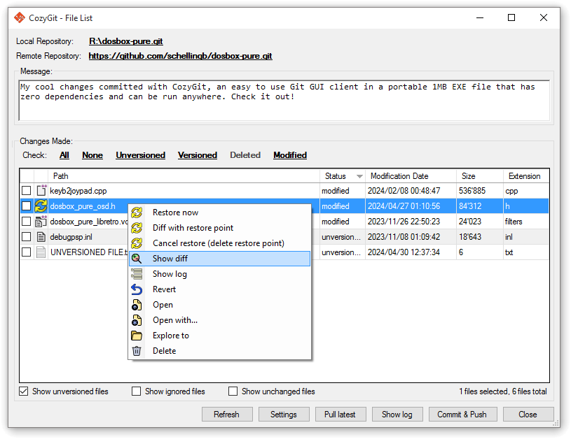
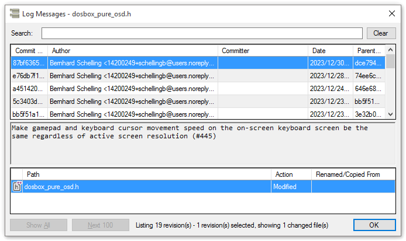

# CozyGit
CozyGit is a Git GUI client for Windows aiming for simplicity and ease of use.

It's also a standalone portable EXE file of around 1 MB in size with zero dependencies.  
Just download it and run it anywhere!

## Screenshots
|
:---:|:---:
Main interface|History log viewer

## Download
You can download the latest version of CozyGit under the [Releases page](https://github.com/schellingb/CozyGit/releases/latest).

Just extract the ZIP file and then run CozyGit.exe.

## Donations
Tips and donations are welcome, you can use the Sponsor button at the top of the [GitHub repository](https://github.com/schellingb/CozyGit).

Thank you for your consideration!

## Usage
Just launch CozyGit.exe and it will ask you for a directory to use as the local workspace.  
Alternatively you can pass the path to the directory as the argument to the program, for example by dragging the directory onto CozyGit.exe in Windows Explorer.

Another option is to add a Windows registry key `HKEY_CLASSES_ROOT\Directory\shell\CozyGit\command` with the `(Default)` value set to
`"X:\<PATH-TO>\CozyGit.exe" "%1"` which then makes CozyGit available from the right-click context menu of a directory in Windows Explorer.

## License
CozyGit is available under the [GPL-2.0 license](https://choosealicense.com/licenses/gpl-2.0/).  
If you are interested in parts of this program under a more permissive or public domain license, feel free to contact me.
